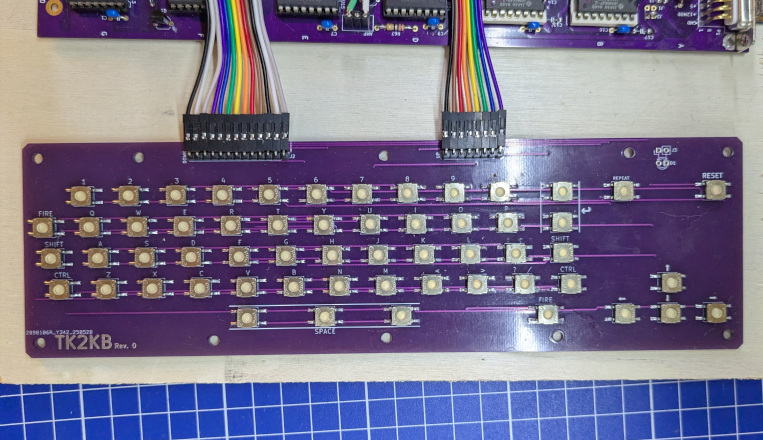

# TK2KB

## DISCLAIMER

Any use of this project is **under your own responsibility**.
You will be responsible of checking the correct construction and functionality of your board.
By using this project You will agree that I cannot be held responsible if it will destroy any of your devices, damage your computer, burn down your house or whatever.

## Introduction

I recently built for myself a [TK2000 clone](https://github.com/clemarfolly/Microdigital-TK2000), but I don't have a keyboard to use it so,
before making an expensive mechanical one, I decided to test the design making one with some cheap SMD switches I had around.

## Hardware

The board was designed with [KiCad](https://kicad.org/) EDA.

### Bill of Materials

| Component              | Qty | Type / Value                                            | Notes                                                                |
| ---------------------- | --- | ------------------------------------------------------- | -------------------------------------------------------------------- |
| D1                     |  1  | 3mm THT LED                                             | Optional                                                             |
| J1                     |  1  | 1x08 2.54mm, right angle pinheader                      |                                                                      |
| J2                     |  1  | 1x13 2.54mm, right angle pinheader                      |                                                                      |
| J3                     |  1  | 1x02 2.54mm, right angle pinheader                      | Optional                                                             |
| SW1-SW57               |  57 | SMD push buttons                                        | KSC241G or compatible                                                |

### Ordering the boards

You can order the board for this project at [PCBWay](https://www.pcbway.com/project/shareproject/TK2KB_TK2000_Keyboard_0d20454f.html) and support me or download 
the gerbers and have them printed wherever you like!!!