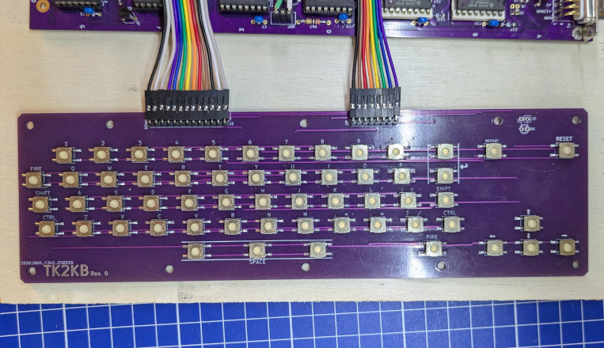

# TK2KB

## DISCLAIMER

Any use of this project is **under your own responsibility**.
You will be responsible of checking the correct construction and functionality of your board.
By using this project You will agree that I cannot be held responsible if it will destroy any of your devices, damage your computer, burn down your house or whatever.

## Introduction

I recently built for myself a [TK2000 clone](https://github.com/clemarfolly/Microdigital-TK2000), but I don't have a keyboard to use it so,
before making an expensive mechanical one, I decided to test the design making one with some cheap SMD switches I had around.

## Hardware

The board was designed with [KiCad](https://kicad.org/) EDA.

### Bill of Materials

| Component              | Qty | Type / Value                                            | Notes                                                                |
| ---------------------- | --- | ------------------------------------------------------- | -------------------------------------------------------------------- |
| D1                     |  1  | 3mm THT LED                                             | Optional                                                             |
| J1                     |  1  | 1x08 2.54mm, right angle pinheader                      |                                                                      |
| J2                     |  1  | 1x13 2.54mm, right angle pinheader                      |                                                                      |
| J3                     |  1  | 1x02 2.54mm, right angle pinheader                      | Optional                                                             |
| SW1-SW57               |  57 | SMD push buttons                                        | KSC241G or compatible                                                |

### Ordering the boards

You can order the board for this project at [PCBWay](https://www.pcbway.com/project/shareproject/TK2KB_TK2000_Keyboard_0d20454f.html) and support me or download 
the gerbers and have them printed wherever you like!!!

### 💰 Selling these boards 💰

I you want to contact me about selling this project, you can reach me via email at `0hkzUNDERSCOREprojects6ATposteoDOTnet` after properly fixing the email address by removing the digits and replacing the uppercase words with the proper characters.

**Contacts via other channels will be ignored**, as it means you did not read this document thoroughly.

"Collaborations" will boil down to the following:

- If you wish to produce and share this project at a loss or at cost, go for it. I am only asking for attribution and to let me know via email.
- If you want to do it for profit, let's discuss it. I'll probably settle for a rough 5% of the profit. Importing components is getting more expensive by the day, so this will contribute to me making future projects available for free.
- I will NOT do customer assistance for you or your customers. This is a hobby, not my job.

If this is not ok for you, you're cordially invited to go bother someone else :)

Authorized sellers will be listed in this README. If you find someone selling my boards without being listed here, it means they're stealing other people's work.

